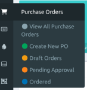
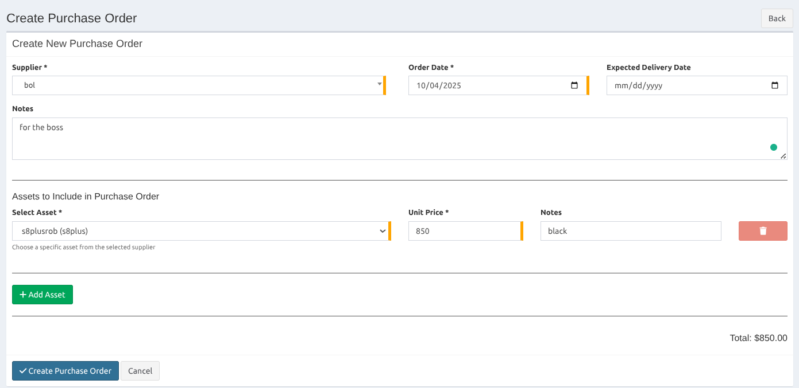
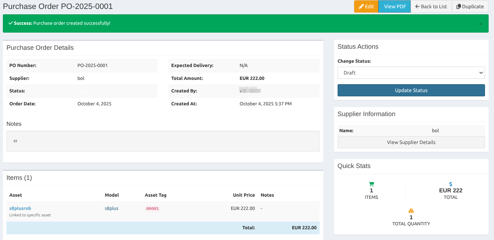
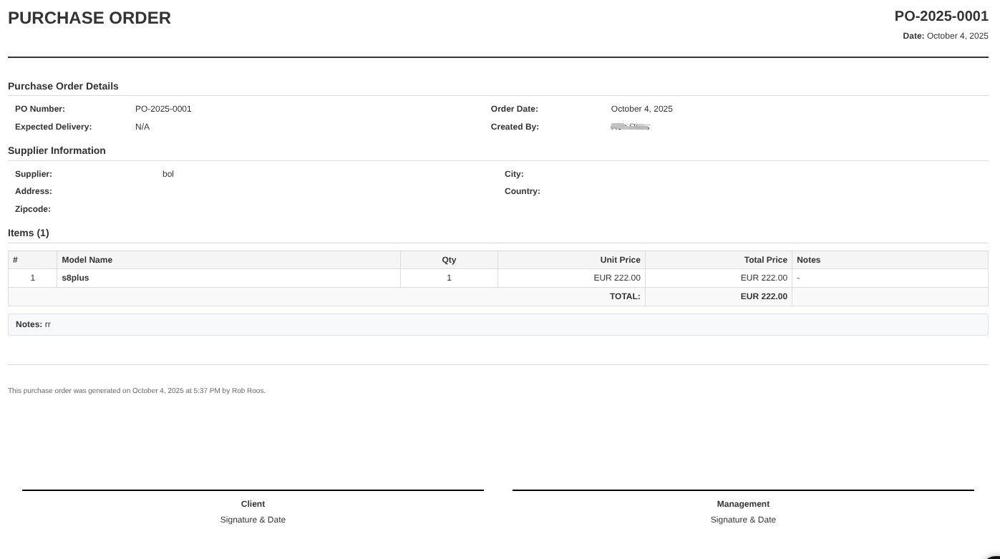

# Purchase Orders Feature

## Overview

This PR adds comprehensive Purchase Orders functionality to Snipe-IT, enabling organizations to track and manage their asset procurement process from purchase to deployment.

## Features

### 📋 Purchase Order Management
- **Full CRUD Operations**: Create, read, update, and delete purchase orders
- **Status Tracking**: Track orders through different states (Draft, Pending, Approved, Received, Cancelled)
- **Supplier Integration**: Link purchase orders to existing suppliers
- **Order Items**: Add multiple items to each purchase order with quantities and pricing

### 🔗 Asset Integration
- **Asset Linking**: Connect assets to their originating purchase orders
- **PO Lookup Button**: Floating button in asset views for quick purchase order lookup
- **Purchase History**: Track which purchase order an asset came from

### 📄 PDF Generation
- **Professional PDFs**: Generate formatted purchase order PDFs for suppliers
- **Company Branding**: Include company information and branding
- **Signature Fields**: Built-in signature areas for approval workflow

### 🧭 Navigation Integration
- **Main Menu**: Purchase Orders appears between Assets and Licenses in navigation
- **Settings Integration**: Purchase Orders option in Settings submenu
- **Color-coded Status**: Visual status indicators throughout the interface

## Installation

Follow the standard Snipe-IT installation process. The Purchase Orders feature requires one additional step for menu integration.

### Database Migration

The following tables will be created during migration:
- `purchase_orders` - Main purchase order records
- `purchase_order_items` - Individual items within purchase orders
- `assets.purchase_order_id` - Foreign key linking assets to purchase orders

### Menu Integration

This PR includes a complete layout file (`resources/views/layouts/default-with-po.blade.php`) that adds Purchase Orders to the navigation menu.

**Installation Options:**

**Option 1: Replace Default Layout (Recommended)**
```bash
cp resources/views/layouts/default-with-po.blade.php resources/views/layouts/default.blade.php
```

**Option 2: Manual Integration**
Add the Purchase Orders menu to your existing `resources/views/layouts/default.blade.php` after the Licenses menu section:

```php
@endcan
@can('view', \App\Models\Asset::class)
    <li class="treeview{{ (Request::is('purchase-orders*') ? ' active' : '') }}">
        <a href="#">
            <i class="fas fa-shopping-cart fa-fw" aria-hidden="true"></i>
            <span>Purchase Orders</span>
            <i class="fas fa-angle-left pull-right fa-fw" aria-hidden="true"></i>
        </a>
        <ul class="treeview-menu">
            <li class="{{ Request::is('purchase-orders') && !Request::is('purchase-orders/create') ? 'active' : '' }}">
                <a href="{{ route('purchase-orders.index') }}">
                    <i class="fas fa-circle text-grey fa-fw" aria-hidden="true"></i>
                    View All Purchase Orders
                </a>
            </li>
            <li class="{{ Request::is('purchase-orders/create') ? 'active' : '' }}">
                <a href="{{ route('purchase-orders.create') }}">
                    <i class="fas fa-circle text-grey fa-fw" aria-hidden="true"></i>
                    Create New PO
                </a>
            </li>
        </ul>
    </li>
@endcan
@can('index', \App\Models\Accessory::class)
```

The Purchase Orders menu will appear between Licenses and Accessories in the main navigation.

## Usage

### Creating a Purchase Order

1. Navigate to **Purchase Orders** in the main menu
2. Click **Create New Purchase Order**
3. Fill in the required information:
   - Order Number (auto-generated if not specified)
   - Supplier
   - Order Date
   - Expected Delivery Date
4. Add items to the purchase order
5. Save and optionally generate PDF

### Linking Assets to Purchase Orders

When creating or editing an asset, you can:
- Select the originating purchase order from the dropdown
- Use the floating "PO Lookup" button to find which purchase order an asset belongs to

### PDF Generation

- Click the **Generate PDF** button on any purchase order
- PDF includes company information, supplier details, and itemized list
- Professional formatting suitable for supplier communication
- **Custom Logo**: Place your company logo at `public/uploads/logo.jpg` to include it in PDFs

## API Endpoints

The Purchase Orders feature includes full API support:

```
GET    /api/v1/purchase-orders          # List all purchase orders
POST   /api/v1/purchase-orders          # Create new purchase order
GET    /api/v1/purchase-orders/{id}     # Get specific purchase order
PUT    /api/v1/purchase-orders/{id}     # Update purchase order
DELETE /api/v1/purchase-orders/{id}     # Delete purchase order
GET    /api/v1/purchase-orders/{id}/pdf # Generate PDF
```

## Permissions

Purchase Orders respect Snipe-IT's existing permission system:
- **View**: Can view purchase orders
- **Create**: Can create new purchase orders
- **Edit**: Can modify existing purchase orders
- **Delete**: Can delete purchase orders

## Testing

A comprehensive testing guide is available in `PURCHASE_ORDERS_TESTING_GUIDE.md` which includes:
- Complete fresh installation testing procedure
- Known issues and solutions
- Compatibility notes for different Snipe-IT versions

## Screenshots

### Purchase Orders Menu Integration


### Create Purchase Order


### Purchase Order Created


### PDF Generation Example


## Technical Details

### File Structure
```
app/
├── Http/Controllers/PurchaseOrderController.php
├── Http/Controllers/AssetPOLookupController.php
├── Models/PurchaseOrder.php
└── Models/PurchaseOrderItem.php

resources/views/purchase-orders/
├── index.blade.php
├── create.blade.php
├── edit.blade.php
├── show.blade.php
└── pdf.blade.php

database/migrations/
├── 2025_10_03_171039_create_purchase_orders_table.php
├── 2025_10_03_171040_create_purchase_order_items_table.php
└── 2025_10_04_052855_add_purchase_order_id_to_assets_table.php
```

### Dependencies
- No additional PHP packages required
- Uses existing Snipe-IT dependencies (Laravel, TCPDF)
- Compatible with existing Snipe-IT themes and customizations

## Contributing

When contributing to the Purchase Orders feature:
1. Follow existing Snipe-IT coding standards
2. Update tests when adding new functionality
3. Ensure compatibility with the latest Snipe-IT version
4. Update documentation for any new features

## Support

For issues related to Purchase Orders functionality:
1. Check the testing guide for known issues
2. Search existing GitHub issues
3. Create a new issue with detailed reproduction steps

---

**Note**: This feature integrates seamlessly with existing Snipe-IT functionality and maintains backward compatibility with all existing installations.
